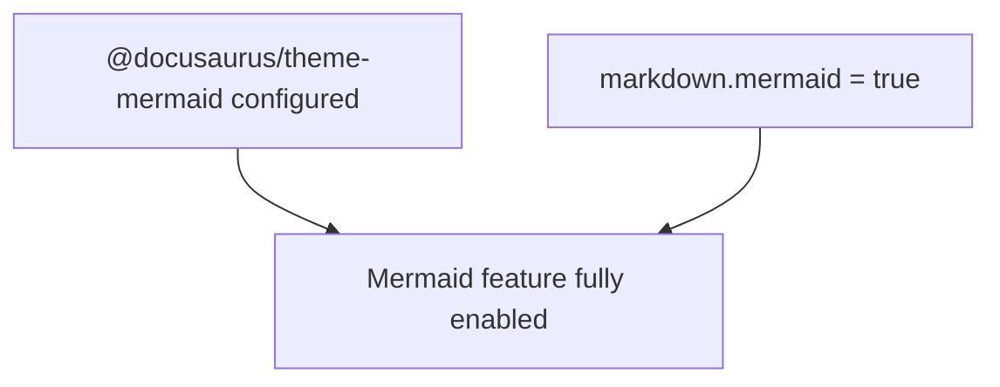

# require-markdown-mermaid-when-theme-mermaid-enabled

Require `markdown.mermaid` to be `true` when `@docusaurus/theme-mermaid` is configured.

## Targeted pattern scope

This rule focuses on `docusaurus.config.*` files.

It reports Mermaid theme setup when:

- `@docusaurus/theme-mermaid` is configured

but:

- `markdown.mermaid` is missing
- `markdown.mermaid` is not `true`

## What this rule reports

This rule reports Mermaid theme configuration that does not also enable Mermaid markdown support.

## Why this rule exists

The Docusaurus Mermaid docs require the theme and the markdown flag together.

Adding only the theme leaves Mermaid markdown features half-enabled and makes the config harder to reason about.

### Mermaid relationship diagram



## ❌ Incorrect

```ts
export default {
    themes: ["@docusaurus/theme-mermaid"],
};
```

## ✅ Correct

```ts
export default {
    themes: ["@docusaurus/theme-mermaid"],
    markdown: {
        mermaid: true,
    },
};
```

## Behavior and migration notes

This rule autofixes the common literal-object cases it can rewrite safely:

- add a new top-level `markdown` object when it is missing
- add `mermaid: true` to an existing `markdown` object
- replace literal `false` with `true`

## Additional examples

### ❌ Incorrect — Mermaid explicitly disabled

```ts
export default {
    themes: ["@docusaurus/theme-mermaid"],
    markdown: {
        mermaid: false,
    },
};
```

### ✅ Correct — Mermaid enabled

```ts
export default {
    themes: ["@docusaurus/theme-mermaid"],
    markdown: {
        mermaid: true,
    },
};
```

## ESLint flat config example

```ts
import docusaurus2 from "eslint-plugin-docusaurus-2";

export default [docusaurus2.configs.recommended];
```

## When not to use it

Do not use this rule if you intentionally keep the Mermaid theme installed without enabling Mermaid markdown support and you do not want linting to normalize that config.

> **Rule catalog ID:** R093

## Further reading

- [Docusaurus theme docs: `@docusaurus/theme-mermaid`](https://docusaurus.io/docs/3.8.1/api/themes/@docusaurus/theme-mermaid)
