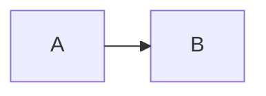

# require-mermaid-elk-package-installed

Require `@mermaid-js/layout-elk` when Mermaid code blocks opt into `layout: elk`.

## Targeted pattern scope

This rule focuses on Markdown and MDX content files.

It inspects Mermaid fenced code blocks and reports ones that opt into ELK layout through frontmatter such as:

- `layout: elk`

## What this rule reports

This rule reports Mermaid diagrams that request ELK layout without the required `@mermaid-js/layout-elk` package being declared in the nearest `package.json`.

## Why this rule exists

Docusaurus 3.9 added support for Mermaid ELK layouts, but the feature requires an extra package installation.

Without `@mermaid-js/layout-elk`, content that opts into `layout: elk` is incomplete and likely to break or confuse maintainers.

## ❌ Incorrect

````mdx

````

Without a matching `package.json` declaration for `@mermaid-js/layout-elk`.

## ✅ Correct

````mdx

````

With a matching `package.json` declaration for `@mermaid-js/layout-elk`.

## Behavior and migration notes

This rule reports only.

It does not edit `package.json` for you.

This rule is not part of any preset. Use the opt-in content config when you want docs-content linting:

```ts
import docusaurus2 from "eslint-plugin-docusaurus-2";

export default [docusaurus2.configs.content];
```

## ESLint flat config example

```ts
import docusaurus2 from "eslint-plugin-docusaurus-2";

export default [docusaurus2.configs.content];
```

## When not to use it

Do not use this rule if your project never uses Mermaid ELK layouts or if dependency ownership is managed entirely outside the nearest package manifest on purpose.

> **Rule catalog ID:** R117

## Further reading

- [Docusaurus 3.9 release notes: Mermaid ELK layouts](https://docusaurus.io/blog/releases/3.9)
- [Mermaid layout algorithms](https://mermaid.js.org/intro/syntax-reference.html#supported-layout-algorithms)
