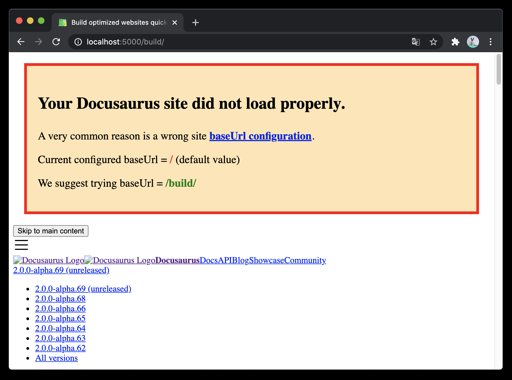

# require-site-config-fields

Require explicit top-level Docusaurus site config fields for deployment, asset loading, and site validation behavior.

## Targeted pattern scope

This rule focuses on `docusaurus.config.*` files.

By default, it requires the following top-level fields to be configured explicitly:

- string fields: `baseUrl`, `deploymentBranch`, `favicon`, `organizationName`, `projectName`
- boolean fields: `baseUrlIssueBanner`
- reporting-severity fields: `onBrokenAnchors`, `onBrokenLinks`, `onDuplicateRoutes`

## What this rule reports

This rule reports missing or invalid top-level site-config fields from the configured required field sets.

## Why this rule exists

Docusaurus supports sensible defaults for site-config fields, but relying on those defaults can hide deployment assumptions and validation behavior that teams often want to make explicit.

For example:

- `baseUrl`, `organizationName`, `projectName`, and `deploymentBranch` communicate deployment intent
- `favicon` makes the site asset contract explicit
- `baseUrlIssueBanner`, `onBrokenAnchors`, `onBrokenLinks`, and `onDuplicateRoutes` make validation and failure behavior explicit

### Example: `baseUrlIssueBanner` in action



This rule is intentionally opinionated and is best suited to stricter repository conventions.

## ❌ Incorrect

```ts
export default {
    title: "Docs",
    url: "https://example.com",
};
```

## ✅ Correct

```ts
export default {
    baseUrl: "/docs/",
    deploymentBranch: "gh-pages",
    favicon: "/img/favicon.ico",
    organizationName: "Nick2bad4u",
    projectName: "eslint-plugin-docusaurus-2",
    baseUrlIssueBanner: true,
    onBrokenAnchors: "warn",
    onBrokenLinks: "throw",
    onDuplicateRoutes: "warn",
};
```

## Behavior and migration notes

This rule reports only. It does not autofix.

Some fields in the default rule configuration are deployment-specific, while others control validation behavior or asset loading.

The defaults are intentionally opinionated for stricter repositories, but you can customize the required field sets with rule options.

### Options

```ts
type Options = [
    {
        requiredBooleanFields?: string[];
        requiredReportingSeverityFields?: string[];
        requiredStringFields?: string[];
    },
];
```

### Default options

```ts
[
    {
        requiredBooleanFields: ["baseUrlIssueBanner"],
        requiredReportingSeverityFields: [
            "onBrokenAnchors",
            "onBrokenLinks",
            "onDuplicateRoutes",
        ],
        requiredStringFields: [
            "baseUrl",
            "deploymentBranch",
            "favicon",
            "organizationName",
            "projectName",
        ],
    },
]
```

## ESLint flat config example

```ts
import docusaurus2 from "eslint-plugin-docusaurus-2";

export default [docusaurus2.configs.strict];
```

## When not to use it

Do not use this rule if your project intentionally relies on Docusaurus defaults for these top-level fields and you do not want linting to enforce explicit site-config declarations.

> **Rule catalog ID:** R036

## Further reading

- [Docusaurus config: `baseUrl`](https://docusaurus.io/docs/api/docusaurus-config)
- [Docusaurus config: `baseUrlIssueBanner`](https://docusaurus.io/docs/api/docusaurus-config)
- [Docusaurus config: deployment and validation fields](https://docusaurus.io/docs/api/docusaurus-config)
