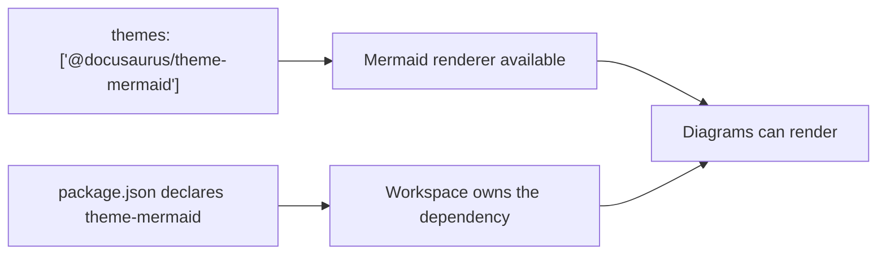

# require-theme-mermaid-package-installed

Require `@docusaurus/theme-mermaid` to be declared in the nearest package manifest when it is configured in Docusaurus config.

## Targeted pattern scope

This rule focuses on `docusaurus.config.*` files.

It reports explicit `@docusaurus/theme-mermaid` entries configured in top-level `themes` or `plugins` arrays when the nearest `package.json` does not declare that package.

## What this rule reports

This rule reports Mermaid theme module usage that is configured in site config but missing from the nearest package manifest dependency fields.

## Why this rule exists

When a Docusaurus site explicitly configures `@docusaurus/theme-mermaid`, the workspace owning that config should also declare the package it depends on.

That keeps workspace-level dependency ownership explicit and avoids config that only works because of unrelated hoisting or transitive installs.

### Mermaid relationship diagram



## ❌ Incorrect

```ts
export default {
    themes: ["@docusaurus/theme-mermaid"],
};
```

## ✅ Correct

```ts
export default {
    themes: ["@docusaurus/theme-mermaid"],
};
```

With a matching `package.json` dependency declaration.

## Behavior and migration notes

This rule is report-only.

It does not edit `package.json` for you.

## ESLint flat config example

```ts
import docusaurus2 from "eslint-plugin-docusaurus-2";

export default [docusaurus2.configs.recommended];
```

## When not to use it

Do not use this rule if your repository intentionally relies on a higher-level workspace package manifest and you do not want each Docusaurus site workspace to declare the package locally.

> **Rule catalog ID:** R099

## Further reading

- [Docusaurus theme docs: `@docusaurus/theme-mermaid`](https://docusaurus.io/docs/3.8.1/api/themes/@docusaurus/theme-mermaid)
